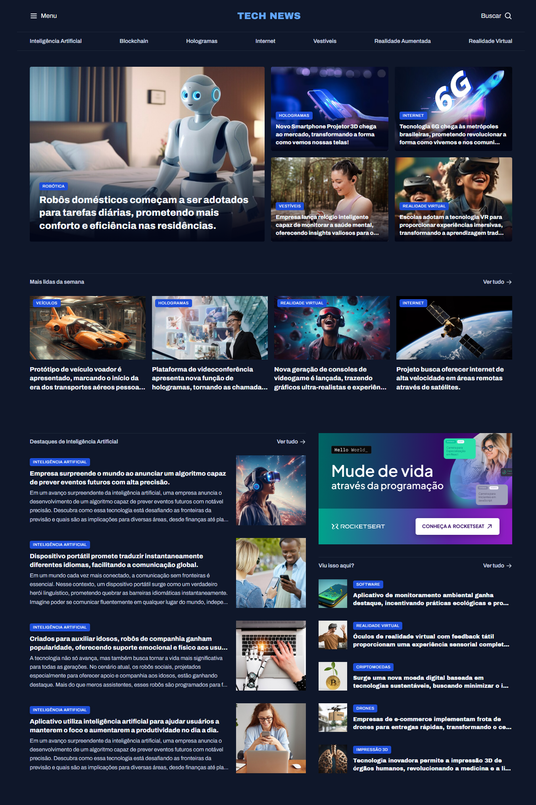

# Página de Portal de Notícias

Este é um projeto de uma página de portal de notícias de tecnologia, desenvolvido com **HTML** e **CSS**. O layout apresenta manchetes em destaque, categorias, notícias mais lidas e seções temáticas, oferecendo uma experiência similar a grandes portais jornalísticos.

## Tecnologias Utilizadas

* **HTML5**: Estruturação do conteúdo da página.
* **CSS3**: Estilização modular usando arquivos separados por seção e layout com Grid e Flexbox.
* **Google Fonts**: Fontes "Archivo" e "Archivo Black" para tipografia.

## Estrutura do Projeto

O projeto está organizado da seguinte forma:

* `index.html`: Estrutura principal da página.
* `styles/index.css`: Arquivo principal que importa todos os módulos de estilo.
* `styles/global.css`: Reset de estilos e variáveis globais CSS.
* `styles/utility.css`: Classes utilitárias para Grid, espaçamentos e tipografia.
* `styles/header.css`: Estilização da barra de navegação e menus.
* `styles/section.css`: Estilização das seções de notícias e layout.
* `assets/`: Pasta com imagens, ícones e logotipo do portal.

## Como Visualizar o Projeto

Acesse diretamente pelo link: [Portal de Notícias no GitHub Pages](https://dandiels.github.io/projeto-portal-de-noticias/).

Ou, se preferir:

1. Clone este repositório:

   ```bash
   git clone https://github.com/Dandiels/projeto-portal-de-noticias.git
   ```
2. Abra o arquivo `index.html` em um navegador web.

## Funcionalidades

* Menu de navegação principal e secundário com links (sem redirecionamento).
* Manchete principal com imagem em destaque.
* Bloco de notícias em categorias.
* Seções "Mais lidas da semana" e "Destaques de Inteligência Artificial".
* Área lateral com anúncios e notícias rápidas.

## Captura de Tela


## Créditos
Projeto inspirado e desenvolvido com referência aos materiais da **Rocketseat**.